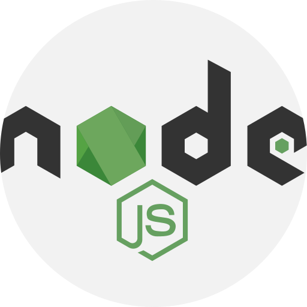

<h1 align="center">
  Challenge Portfolio
</h1>
 
<h4 align="center">
      
      
      
      
      
</h4>
 
 

  <a href="#floppy_disk-technology">Technology</a>&nbsp;&nbsp;&nbsp;|&nbsp;&nbsp;&nbsp;
  <a href="#computer-project">Project</a>&nbsp;&nbsp;&nbsp;|&nbsp;&nbsp;&nbsp;
  <a href="#blue_heart-contributors">Contributors</a>

 

In this Repository I concentrated the first challenges of Bootcamp GoStack in 2020 where I was able to put the acquired knowledge into practice.

You can learn more about Bootcamp on the

## :floppy_disk: Technology

This project was developed with the following technologies:

<ul>
  <li><a href="https://sass-lang.com/">JavaScript</a></li>
  <li><a href="https://developer.mozilla.org/en-US/docs/Web/HTML">HTML</a></li>
  <li><a href="https://facebook.github.io/jsx/">JSX</a></li>
  <li><a href="https://sass-lang.com/">Sass</a></li>
  <li><a href="https://reactjs.org/">ReactJs</a></li>
  <li><a href="https://reacttraining.com/react-router/">React Router DOM</a></li>
  <li><a href="https://fullpage.caferati.me/">React Awesome Slider</a></li>
  <li><a href="https://www.npmjs.com/package/react-toasts">React Toasts</a></li>
  <li><a href="https://react-icons.github.io/react-icons/">React Icons</a></li>
  <li><a href="https://prettier.io/">Prettier</a></li>
  <li><a href="https://eslint.org/">EsLint</a></li>
  <li><a href="https://babeljs.io/">Babel</a></li>
  <li><a href="https://webpack.js.org/">Webpack</a></li>
</ul>

## :computer: Project

<h2>Under development</h2>
 
 
 
## :purple_heart: Contributors

<table>
  <tr>
    <td align="center" style="border: none;">
      <a href="https://github.com/alinecbsr">
        
         
        
          <b>Aline Rosa</b>
        
      </a>
       
      
<scan title="Code">💻</scan>|<scan title="Documentation">🎨</scan>|<scan title="Bugs">🐛</scan>

    </td>
  </tr>
</table>
